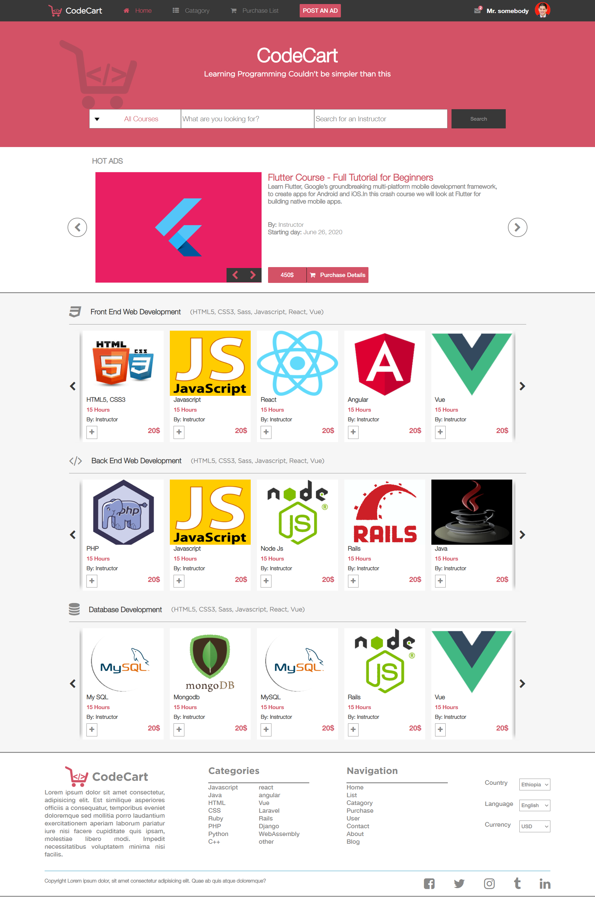
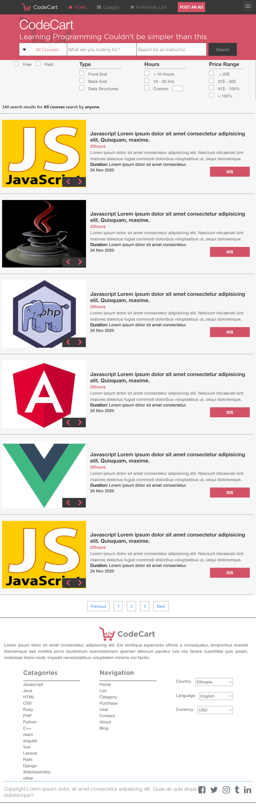
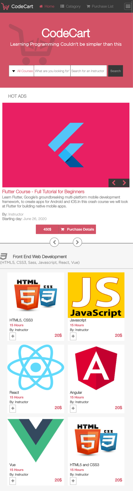

# Online Shop for programming Courses
This capstone project is a webpage that displays online programming course materials that are available for free or for purchase.

## Large Size of Main Page

## Medium Size of Search Page 

## Small Size of Main page

This project is the Final project of the HTML/CSS curriculum under Microverse. 

## Built With

- HTML/CSS
- CSS 
- Bootstrap (for the search page only)
- fontawesome
- npm
- Adobe PS (for logo)
- Stylelint, Webhint, Lighthouse
- VSCode (with Prettier, Stylelint)
- Google Chrome (with DevTools)

## Live Demo

[Check the project out here](https://rawcdn.githack.com/Berabjesus/Online-shop-for-programming-courses/adaae55d064fbb809e08c8bf9cd573222ccb4e59/index.html)

## Getting Started

**To get this project set up on your local machine, follow these simple steps:**

1. Open Terminal.

2. Navigate to your desired location to download the contents of this repository.

3. Copy and paste the following code into the Terminal:

    git clone https://github.com/Berabjesus/Online-shop-for-programming-courses.git

4. Hit enter.

5. Once the repository has been cloned, open index.html in a browser of your choosing. Click on the search button to navigate to the search results page or you can open the search.html file.

### Prerequisites

- A computer, a smartphone, or another similar device.
- Access to the internet.

## Authors

👤 **Bereket Beshane**

- Github: [@berabjesus](https://github.com/Berabjesus)
- Twitter: [@bereket_ababu_b](https://twitter.com/bereket_ababu_b)
- Linkedin: [linkedin](https://www.linkedin.com/in/bereket-beshane-a1b75a1a9/)

## 🤝 Contributing

Contributions, issues, any kind of feedback and feature requests are welcome!

## Show your support

Give a ⭐️ if you like this project!

## Acknowledgments

- Layout Design by [Mohammed Awad](https://www.behance.net/M_Awad)

## 📝 License

This project has no license
