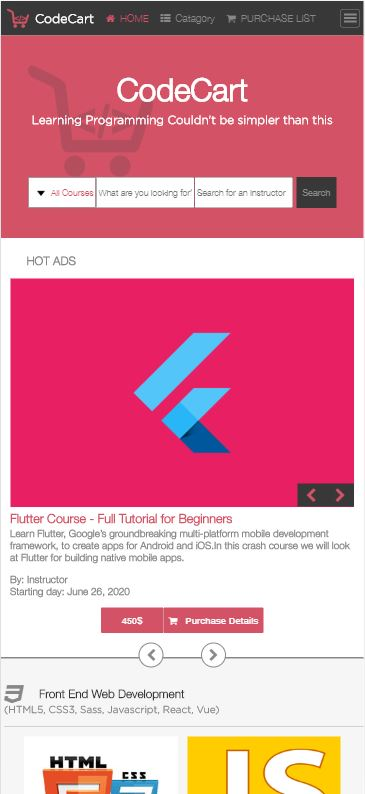

# Online Shop for programming Courses
This capstone project is a webpage that displays online programming course materials that are available for free or for purchase.

## Large Size of Main Page

## Medium Size of Search Page 

## Small Size of Main page

This project is the Final project of the HTML/CSS curriculum under Microverse. 

## Built With

- HTML5, CSS3 (Home Page)
- BootStrap 4 (search results page)
- Javascript

## Live Demo

[Check it out](https://rawcdn.githack.com/Berabjesus/Online-shop-for-programming-courses/7e04a16b30a29f3638b9d24de17540fc393b9ce1/index.html)
## Authors

👤 **Bereket Beshane**

- Github: [@berabjesus](https://github.com/Berabjesus)
- Twitter: [@bereket_ababu_b](https://twitter.com/bereket_ababu_b)
- Linkedin: [linkedin](https://www.linkedin.com/in/bereket-beshane-a1b75a1a9/)

## 🤝 Contributing

Contributions, issues, any kind of feedback and feature requests are welcome!

## Show your support

Give a ⭐️ if you like this project!

## Acknowledgments

- Layout Design by [Mohammed Awad](https://www.behance.net/M_Awad)

## 📝 License

This project has no license
